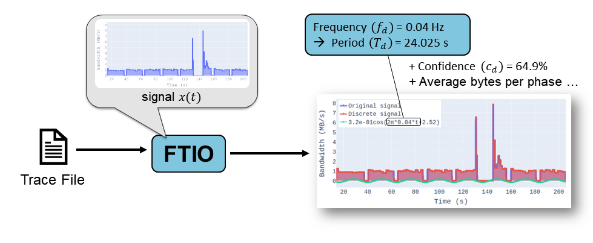
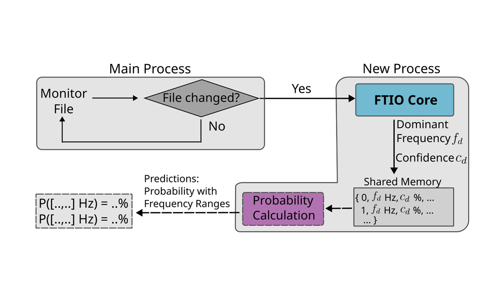

<!-- # FTIO -->
![license][license.bedge]


<!--  -->


<br />
<div align="center">
<!-- TODO: Add logo -->
  <!-- <a href="https://git.rwth-aachen.de/parallel/ftio">
    
  </a> -->

  <h1 align="center"> FTIO</h1>
  <p align="center">
	<h3 align="center"> Frequency Techniques for I/O </h2>
    <!-- <br /> -->
    <a href="https://github.com/tuda-parallel/FTIO/tree/main/docs/approach.md"><strong>Explore the approach »</strong></a>
    <br />
    <!-- <br /> -->
    <a href="https://git.rwth-aachen.de/parallel/ftio">View Demo</a>
    ·
    <a href="https://github.com/tuda-parallel/FTIO/issues">Report Bug</a>
    ·
    <a href="https://github.com/tuda-parallel/FTIO/issues">Request Feature</a>
  </p>
</div>


FTIO captures periodic I/O using frequency techniques. 
Many high-performance computing (HPC) applications perform their I/O in bursts following a periodic pattern. 
Predicting such patterns can be very efficient for I/O contention avoidance strategies, including burst buffer management, for example. 
FTIO allows [*offline* detection](#offline-detection) and [*online* prediction](#online-prediction) of periodic I/O phases. 
FTIO uses the discrete Fourier transform (DFT), combined with outlier detection methods to extract the dominant frequency in the signal. 
Additional metrics gauge the confidence in the output and tell how far from being periodic the signal is. 
A complete description of the approach is provided [here](https://github.com/tuda-parallel/FTIO/tree/main/docs/approach.md).


This repository provides two main Python-based tools: 
- [`ftio`](#online-pridiction):  uses frequency techniques, outlier detection methods to find the period of I/O 
- [`predictor`](#offline-detection): implements the online version of FTIO. It simply reinvokes FTIO whenever new traces are appended to the monitored file. See [online prediction](#online-prediction) for more details. We recommend using [TMIO](https://github.com/tuda-parallel/TMIO) to generate the file with the I/O traces.


Other tools:
- [`ioplot`](https://github.com/tuda-parallel/FTIO/tree/main/docs/approach.md) generates interactive plots in HTML
- [`parse`](https://github.com/tuda-parallel/FTIO/tree/main/docs/approach.md) parses and merges several traces to an [Extra-P](https://github.com/extra-p/extrap) supported format. This allows to examine the scaling behavior of the monitored metrics. 


<!-- TABLE OF CONTENTS -->
<details>
  <summary>Table of Contents</summary>
  <ol>
    <li>
      <a href="#getting-started">Getting Started</a>
      <ul>
        <li><a href="#prerequisites">Prerequisites</a></li>
        <li><a href="#installation">Installation</a></li>
      </ul>
    </li>
    <li><a href="#quick-start">Usage</a></li>
    <li><a href="#contributing">Contributing</a></li>
    <li><a href="#contact">Contact</a></li>
    <li><a href="#license">License</a></li>
    <li><a href="#acknowledgments">Acknowledgments</a></li>
	<li><a href="#citation">Citation</a></li>
	<li><a href="#publications">Publications</a></li>
  </ol>
</details>

Join the [Slack channel](https://join.slack.com/t/ftioworkspace/shared_invite/zt-2bydqdt13-~hIHzIrKW2zJY_ZWJ5oE_g) or see latest updates here: [Latest News](https://github.com/tuda-parallel/FTIO/tree/main/ChangeLog.md)


## Offline Detection

`FTIO` generates frequency predictions. There are several options available to enhance the predictions. In the standard mode, the DFT is used in combination with an outlier detection method. In the latest version, autocorrelation was added to `FTIO`:

1. DFT + outlier detection (Z-score, DB-Scan, Isolation forest, peak detection, or LOF)​
2. Optionally: Autocorrelation + Peak detection
3. Merge results from both predictions

An overview of `FTIO` is provided in the image below:

<br />
<div align="center">
  <!-- <a href="https://github.com/othneildrew/Best-README-Template"> -->
<!--  -->

  </a>
</div>
<br />

<br />

 ## Online Prediction:  

The other tool, `predictor`, launches FTIO in a loop. It monitors a file for changes. The file contains bandwidth values over time (see [Quick Start](#quick-start)). Once the file changes, FTIO is called and a new prediction is found. `predictor` performs a few additional steps compared FTIO:
* FTIO results are merged into frequency ranges using DB-Scan​
* Conditional probability is calculated​
* Data is further processed (e.g., average bytes estimation, estimated number of phases,...)

An overview of predictor.py is provided in the image below:

<br />
<div align="center">
  <!-- <a href="https://github.com/othneildrew/Best-README-Template"> -->

  </a>
</div>
<br />


## Installation

FTIO can be installed either [automatically](#automated-installation) or [manually](#manual-installation). 


### Automated installation:

Simply call the make command:

```sh
make install
```

This generates a virtual environment in the current directory, sources `.venv/bin/activate`, and installs FTIO as a module. 

If you don't need a dedicated environment, simply call:

```sh
make ftio
```


### Manual installation:

Create a virtual environment if needed and activate it:

```sh
python3 -m venv .venv
source .venv/bin/activate
```

Install all tools provided in this repo simply by using pip:

```sh
pip install .
```

Note: you need to activate the environment to use `ftio` and the other tools using:

```sh
source path/to/venv/bin/activate
```

<p align="right">(<a href="#top">back to top</a>)</p>

## Getting Started
For installation instructions see [installation](#installation).

To call `ftio` on a single file, use:
```sh
ftio filename.extension
```

Supported extensions are `json`, `jsonLines`, `msgpack`, and `darshan`. For recorder, provide the path to the folder instead of `filename.extension`. 


### Usage
FTIO provides various options and extensions. In the default
To see all available command line arguments, call:

```sh
ftio -h

  

usage: 
ftio [-h] [-m MODE] [-r RENDER] [-f FREQ] [-ts TS] [-te TE]
     [-tr TRANSFORMATION] [-e ENGINE] [-o OUTLIER] [-l LEVEL] [-t TOL] [-d] 
     [-nd] [-re] [--no-reconstruction] [-p] [-c] [-s] [-ns] [-a] [-na] [-i] 
     [-ni] [-x DXT_MODE] files [files ...]

```

### Testing

There is a `8.jsonl` file provided for testing. Here just call:

```sh
ftio 8.jsonl
```
<p align="right">(<a href="#top">back to top</a>)</p>


The most relevant settings are:

| Flag | Description|
|--- | --- |
| -m MODE| MODE can be sync_read, sync_write (default), async_read, or async_write|
|-f FREQ | Specifies the sampling rate of the discretization of the signal. This directly affects the lowest highest captured frequency (Nyquist). FREQ is specified in Hz, In case this value is set to -1, the auto mode is launched which specifies FREQ as the smallest change in the bandwidth is detected, and the FREQ is set to this value. Note that the lowest allowed frequency in the auto mode is 2000 Hz|
|-o OUTLIER| Outlier detection method: Z-score, DB-Scan, Isolation_forest, or LOF|
|-e ENGINE| Plot engine. Either plotly (default) or mathplotlib. Specifies the engine used to display the figures. Plotly is used to generate HTML files. Specifiy no in case no plots are desired|
|-c |autocorrelation: if set, autocorrelation is calculated in addition to dft|
|-p| psd: if set, replace the amplitude spectrum (a) calculation with power density spectrum (a*a/N)|

`predictor` has the same syntax as `FTIO`. 
All arguments that are available for `FTIO` are also available for `predictor``.

<p align="right">(<a href="#top">back to top</a>)</p>

<!-- CONTRIBUTING -->
## Contributing

Contributions are what make the open-source community such an amazing place to learn, inspire, and create. Any contributions you make are **greatly appreciated**.

If you have a suggestion that would make this better, please fork the repo and create a pull request. You can also simply open an issue with the tag "enhancement".
Don't forget to give the project a star! Thanks again!

1. Fork the Project
2. Create your Feature Branch (`git checkout -b feature/AmazingFeature`)
3. Commit your Changes (`git commit -m 'Add some AmazingFeature'`)
4. Push to the Branch (`git push origin feature/AmazingFeature`)
5. Open a Pull Request

<p align="right">(<a href="#top">back to top</a>)</p>


<!-- CONTACT -->
## Contact
Ahmad Tarraf
- ahmad.tarraf@tu-darmstadt.de 
- [![][linkedin.bedge]][linkedin.profile]
- [![][parallel.bedge]][parallel_website]

Project Link: [https://git.rwth-aachen.de/parallel/ftio](https://git.rwth-aachen.de/parallel/ftio)

<p align="right">(<a href="#top">back to top</a>)</p>


## License

Distributed under the BSD 3-Clause License. See [LISCENCE](./LICENSE) for more information.
<p align="right">(<a href="#top">back to top</a>)</p>

<!-- ACKNOWLEDGMENTS -->
## Acknowledgments
Authors: 
  - Ahmad Tarraf
  - Add your name here

This work is a result of a coopertion between the Technical University of Darmstadt 
and INRIA. 


## Citation:
```
 @inproceedings{Tarraf_Bandet_Boito_Pallez_Wolf_2024, 
 	author={Tarraf, Ahmad and Bandet, Alexis and Boito, Francieli and Pallez, Guillaume and Wolf, Felix},
 	title={Capturing Periodic I/O Using Frequency Techniques}, 
 	booktitle={2024 IEEE International Parallel and Distributed Processing Symposium (IPDPS)}, 
 	address={San Francisco, CA, USA}, 
 	year={2024},
 	month=may, 
 	pages={1–14}, 
 	notes = {(accepted)}
 }
```
<p align="right">(<a href="#top">back to top</a>)</p>


## Publications:
1. A. Tarraf, A. Bandet, F. Boito, G. Pallez, and F. Wolf, “Capturing Periodic I/O Using Frequency Techniques,” in 2024 IEEE International Parallel and Distributed Processing Symposium (IPDPS), San Francisco, CA, USA, May 2024, pp. 1–14.

2. A. Tarraf, A. Bandet, F. Boito, G. Pallez, and F. Wolf, “FTIO: Detecting I/O periodicity using frequency techniques.” 2023.


[JQuery.com]: https://img.shields.io/badge/jQuery-0769AD?style=for-the-badge&logo=jquery&logoColor=white
[JQuery-url]: https://jquery.com 


<!-- https://img.shields.io/badge/any_text-you_like-blue -->

<!--* Badges *-->
[pipeline.badge]: https://git.rwth-aachen.de/parallel/ftio/badges/main/pipeline.svg
[coverage.badge]: https://git.rwth-aachen.de/parallel/ftio/badges/main/coverage.svg
[python.bedge]: https://img.shields.io/badge/python-3670A0?style=for-the-badge&logo=python&logoColor=ffdd54
[license.bedge]: https://img.shields.io/badge/License-BSD_3--Clause-blue.svg
[linkedin.bedge]: https://img.shields.io/badge/LinkedIn-0077B5?tyle=for-the-badge&logo=linkedin&logoColor=white
[linkedin.profile]: https://www.linkedin.com/in/dr-ahmad-tarraf-8b6942118
[parallel_website]: https://www.parallel.informatik.tu-darmstadt.de/laboratory/team/tarraf/tarraf.html
[parallel.bedge]: https://img.shields.io/badge/Parallel_Programming:-Ahmad_Tarraf-blue
[pull.bedge]: https://img.shields.io/github.com/tuda-parallel/FTIO/pulls


<!--* links *-->
[issue]: https://github.com/tuda-parallel/FTIO/issues
[pull]: https://github.com/tuda-parallel/FTIO/pulls
[insight]: https://github.com/tuda-parallel/FTIO/network/dependencies