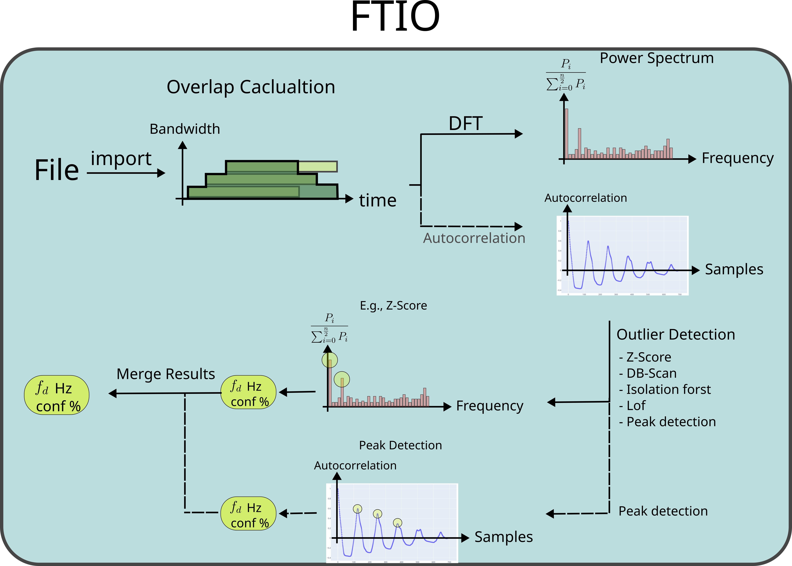
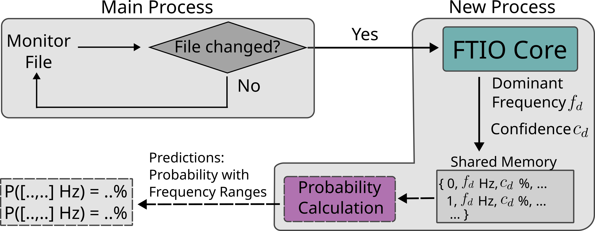

# FTIO

**Capturing Periodic I/O Using Frequency Techniques**


![license][license.bedge] 


<!--  -->


<br />
<div align="center">
  <a href="https://git.rwth-aachen.de/parallel/ftio">
    <!--  -->
	FTIO LOGO
  </a>

  <h1 align="center">FTIO</h1>

  <p align="center">
    Frequency techniques for I/O
    <br />
    <a href="https://git.rwth-aachen.de/parallel/ftio/-/wikis/home"><strong>Explore the docs »</strong></a>
    <br />
    <br />
    <a href="https://git.rwth-aachen.de/parallel/ftio">View Demo</a>
    ·
    <a href="https://git.rwth-aachen.de/parallel/ftio/issues">Report Bug</a>
    ·
    <a href="https://git.rwth-aachen.de/parallel/ftio/issues">Request Feature</a>
  </p>
</div>

  

This repository contains the FTIO source code.
- For installation, see [Installation](#installation)
- See the list of updates here: [Latest News](#latest-news)

<!-- TABLE OF CONTENTS -->
<details>
  <summary>Table of Contents</summary>
  <ol>
    <li>
      <a href="#about-the-project">About The Project</a>
      <ul>
        <li><a href="#built-with">Built With</a></li>
      </ul>
    </li>
    <li>
      <a href="#getting-started">Getting Started</a>
      <ul>
        <li><a href="#prerequisites">Prerequisites</a></li>
        <li><a href="#installation">Installation</a></li>
      </ul>
    </li>
    <li><a href="#quick-start">Usage</a></li>
    <li><a href="#roadmap">Roadmap</a></li>
    <li><a href="#contributing">Contributing</a></li>
    <li><a href="#contact">Contact</a></li>
    <li><a href="#license">License</a></li>
    <li><a href="#acknowledgments">Acknowledgments</a></li>
  </ol>
</details>

## About The Project
`FTIO` stands for **F**requency **t**echniques for **I**/**O**.
This repository provides two tools: `FTIO` and `predictor`. Both tools 
are written in Python. `FTIO` uses frequency techniques, outlier detection methods, and clustering methods to predict the perodificty of I/O (see [FTIO](#ftio-frequency-techniques-for-io)). The task of periodically reinvoking `FTIO`` is done by `predictor` to calculate the probability of periodic I/O (see [predictor](#predictor)). 


### FTIO:  **F**requency **T**echniques for **I**/**O**
`FTIO` generates frequency predictions. There are several options available to enhance the predictions. In the standard mode, the DFT is used in combination with an outlier detection method. In the latest version, autocorrelation was added to `FTIO`:

1. DFT + outlier detection (Z-score, DB-Scan, Isolation forest, peak detection, or LOF)​
2. Optionally: Autocorrelation + Peak detection
3. Merge results from both predictions

An overview of `FTIO` is provided in the image below:

<br />
<div align="center">
  <!-- <a href="https://github.com/othneildrew/Best-README-Template"> -->

  </a>
</div>
<br />

<br />

 ### Predictor
The other tool, `predictor`, launches FTIO in a loop. It basically monitors a file for changes. The file contains bandwidth values over time (see [Quick Start](#quick-start)). Once the file changes, FTIO is called and a new prediction is found. `predictor` performs a few additional steps compared FTIO:
* FTIO results are merged into frequency ranges using DB-Scan​
* Conditional probability is calculated​
* Data is further processed (e.g., average bytes estimation, estimated number of phases,...)

An overview of predictor.py is provided in the image below:

<br />
<div align="center">
  <!-- <a href="https://github.com/othneildrew/Best-README-Template"> -->

  </a>
</div>
<br />

For any questions, feel free to contact me: <ahmad.tarraf@tu-darmstadt.de>

### Built With
The project was build with Python.

- ![python][python.bedge] 


## Latest News

- Speed-up with msgpack
- Added autocorrelation to FTIO
- Added 4 new outlier detection methods


## Getting Started
### Prerequisites
see `./install/install_packages.py`
### Installation
There are two options for installation: [Automated](#automated) or [manually](#manually). Below both are described
#### Automated

Just a single command is needed:
```sh
make install
```
This creates a virtual environment and installs the required packages locally. It also installs FTIO and predictor into `~/.local/bin`, such that both tools can be called directly on the command line. You can change the installation path by setting the variable `INSTALL_DIR` in the make file

#### Manually

Install a virtual environment in your desired location:
```sh
python3 -m venv your_folder
```

Active it:
```sh
source your_folder/bin/activate
```

Install the following modules:
```sh
python3 -m pip install darshan extrap fastdtw pandas numpy jsonlines numba plotly PyWavelets sklearn scipy seaborn scikit-learn kneed
```

Now install `FTIO`:
```sh
make ftio
```

### Testing
After installation, `FTIO`` is installed in `~/.local/bin/ftio`. Now `FTIO` can
be called from the command line:

```sh
ftio file_name
```

Use test.sh to check that everything works like it should:

```sh
./test.sh
```
You might have to change the path to the Python environment in `test.sh` if you manually installed ftio.
<p align="right">(<a href="#readme-top">back to top</a>)</p>

## Usage

To call ftio on a single file, use:
```sh
ftio filename.extension
```

Supported extensions are `json`, `jsonLines`, `msgpack`, and `darshan`. For recorder, provide the path to the folder instead of `filename.extension`. There is a `8.jsonl` file provided for testing. Here just call:

```sh
ftio 8.jsonl
```

To see all available command line arguments, call:

```sh
ftio -h

  

usage: 
ftio [-h] [-m MODE] [-r RENDER] [-f FREQ] [-ts TS] [-te TE]
     [-tr TRANSFORMATION] [-e ENGINE] [-o OUTLIER] [-l LEVEL] [-t TOL] [-d] 
     [-nd] [-re] [--no-reconstruction] [-p] [-c] [-s] [-ns] [-a] [-na] [-i] 
     [-ni] [-x DXT_MODE] files [files ...]

```

The most relevant settings are:

| Flag | Description|
|--- | --- |
| -m MODE| MODE can be sync_read, sync_write (default), async_read, or async_write|
|-f FREQ | Specifies the sampling rate of the discretization of the signal. This directly affects the lowest highest captured frequency (Nyquist). FREQ is specified in Hz, In case this value is set to -1, the auto mode is launched which specifies FREQ as the smallest change in the bandwidth is detected, and the FREQ is set to this value. Note that the lowest allowed frequency in the auto mode is 2000 Hz|
|-o OUTLIER| Outlier detection method: Z-score, DB-Scan, Isolation_forest, or LOF|
|-e ENGINE| Plot engine. Either plotly (default) or mathplotlib. Specifies the engine used to display the figures. Plotly is used to generate HTML files. Specifiy no in case no plots are desired|
|-c |autocorrelation: if set, autocorrelation is calculated in addition to dft|
|-p| psd: if set, replace the amplitude spectrum (a) calculation with power density spectrum (a*a/N)|

`predictor` has the same syntax as `FTIO`. 
All arguments that are available for `FTIO` are also available for `predictor``.

<p align="right">(<a href="#readme-top">back to top</a>)</p>

<!-- CONTRIBUTING -->
## Contributing

Contributions are what make the open-source community such an amazing place to learn, inspire, and create. Any contributions you make are **greatly appreciated**.

If you have a suggestion that would make this better, please fork the repo and create a pull request. You can also simply open an issue with the tag "enhancement".
Don't forget to give the project a star! Thanks again!

1. Fork the Project
2. Create your Feature Branch (`git checkout -b feature/AmazingFeature`)
3. Commit your Changes (`git commit -m 'Add some AmazingFeature'`)
4. Push to the Branch (`git push origin feature/AmazingFeature`)
5. Open a Pull Request

<p align="right">(<a href="#readme-top">back to top</a>)</p>


<!-- CONTACT -->
## Contact
Ahmad Tarraf
- ahmad.tarraf@tu-darmstadt.de 
- [![][linkedin.bedge]][linkedin.profile]
- [![][parallel.bedge]][parallel_website]

Project Link: [https://git.rwth-aachen.de/parallel/ftio](https://git.rwth-aachen.de/parallel/ftio)

<p align="right">(<a href="#readme-top">back to top</a>)</p>


## License

Distributed under the BSD 3-Clause License. See `LICENSE.txt` for more information.
<p align="right">(<a href="#readme-top">back to top</a>)</p>

<!-- ACKNOWLEDGMENTS -->
## Acknowledgments
Authors: 
  - Ahmad Tarraf
  - Add your name here

This work is a result of a coopertion between the Technical University of Darmstadt 
and INRIA. 

Publication:
```
@inproceedings{tarraf2024ftio,
      title={Capturing Periodic I/O Using Frequency Techniques , 
      author={Ahmad Tarraf and Alexis Bandet and Francieli Boito and Guillaume Pallez and Felix Wolf},
	  booktitle={2024 IEEE International Parallel and Distributed Processing Symposium (IPDPS)},
      year={2024},
	  pages = {1--12},
  	  publisher = {IEEE},
}

@misc{tarraf2023ftio,
      title={FTIO: Detecting I/O Periodicity Using Frequency Techniques}, 
      author={Ahmad Tarraf and Alexis Bandet and Francieli Boito and Guillaume Pallez and Felix Wolf},
      year={2023},
      eprint={2306.08601},
      archivePrefix={arXiv},
      primaryClass={cs.DC}
}
```
<p align="right">(<a href="#readme-top">back to top</a>)</p>

<!-- LICENSE -->


[JQuery.com]: https://img.shields.io/badge/jQuery-0769AD?style=for-the-badge&logo=jquery&logoColor=white
[JQuery-url]: https://jquery.com 


<!-- https://img.shields.io/badge/any_text-you_like-blue -->

[pipeline.badge]: https://git.rwth-aachen.de/parallel/ftio/badges/main/pipeline.svg

[coverage.badge]: https://git.rwth-aachen.de/parallel/ftio/badges/main/coverage.svg
[python.bedge]: https://img.shields.io/badge/python-3670A0?style=for-the-badge&logo=python&logoColor=ffdd54
[license.bedge]: https://img.shields.io/badge/License-BSD_3--Clause-blue.svg
[linkedin.bedge]: https://img.shields.io/badge/LinkedIn-0077B5?tyle=for-the-badge&logo=linkedin&logoColor=white
[linkedin.profile]: https://www.linkedin.com/in/dr-ahmad-tarraf-8b6942118
[parallel_website]: https://www.parallel.informatik.tu-darmstadt.de/laboratory/team/tarraf/tarraf.html
[parallel.bedge]: https://img.shields.io/badge/Parallel_Programming:-Ahmad_Tarraf-blue
[pull.bedge]: https://img.shields.io/github.com/tuda-parallel/FTIO/pulls
