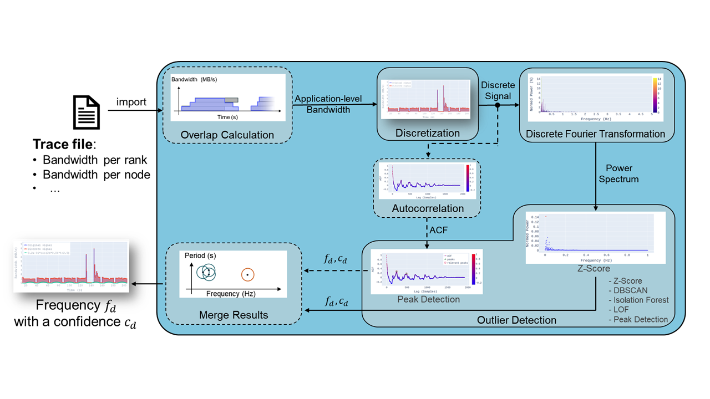

# Approach

FTIO supports two modes:
- [Approach](#approach)
	- [Offline Detection](#offline-detection)
	- [Online Prediction](#online-prediction)

## Offline Detection
the Python implementation of FTIO ([`ftio`](https://github.com/tuda-parallel/FTIO/tree/main/ftio/cli/ftio_core.py)) takes the traces that contain the bandwidth over time to find the period of the I/O phases (if any). 
An overview of `ftio` is provided in the image below:

 

  <!-- <a href="https://github.com/othneildrew/Best-README-Template"> -->
<!--  -->

  </a>

 

All `ftio` needs, is the bandwidth over time. That is, three vectors are required. One that specifies the bandwidth, one that specifies the start time of this bandwidth, and one that specifies the end time of the bandwidth. 
This information can be on the rank level, node level, or application level. `ftio` internally calculates the bandwidth at the application level. 

An overview of the core of FTIO is provided below:

 

  </a>

 

<a href="#top">⬆</a>

 ## Online Prediction 

The tool `predictor` launches `ftio` in a loop. It monitors a file for changes. The file contains bandwidth values over time (see [Quick Start](#quick-start)). Once the file changes, `ftio` is called and a new prediction is found. `predictor` performs a few additional steps compared `ftio`:
* FTIO results are merged into frequency ranges using DB-Scan​
* Conditional probability is calculated
* Data is further processed (e.g., average bytes estimation, estimated number of phases,...)

An overview of predictor.py is provided in the image below:

 

  <!-- <a href="https://github.com/othneildrew/Best-README-Template"> -->

  </a>

 

<a href="#top">⬆</a>

