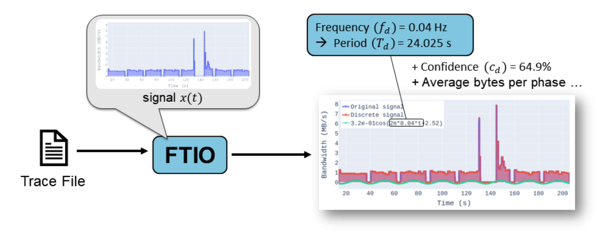
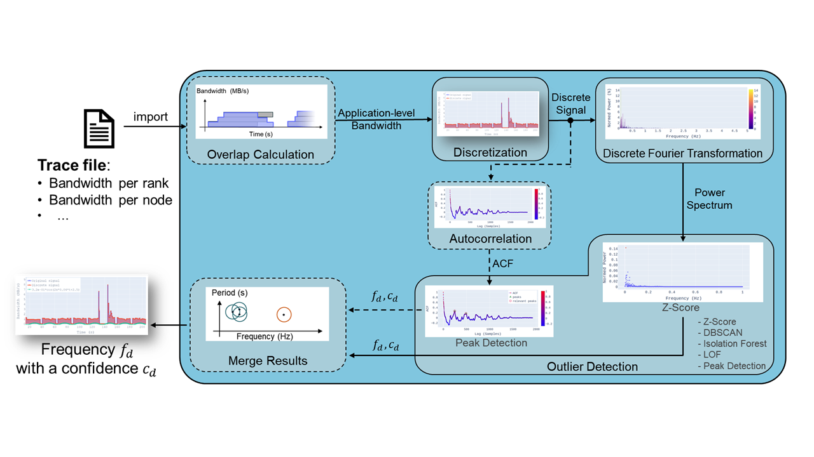
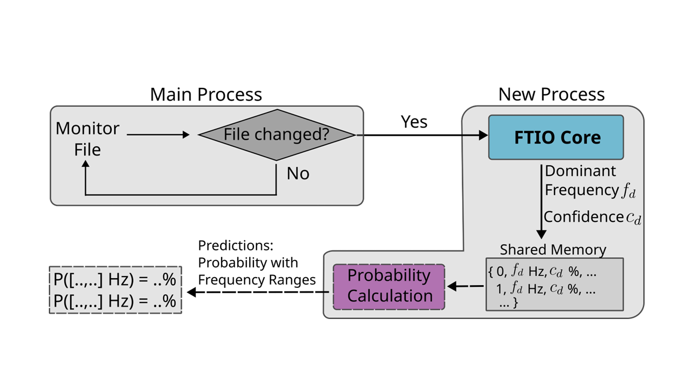

# Approach

FTIO supports two modes:
- [Approach](#approach)
	- [Offline Detection](#offline-detection)
	- [Online Prediction](#online-prediction)
	- [Burst Width Estimation](#burst-width-estimation)

## Offline Detection
The Python implementation of FTIO ([`ftio`](https://github.com/tuda-parallel/FTIO/tree/main/ftio/cli/ftio_core.py)) takes the traces that contain the bandwidth over time to find the period of the I/O phases (if any). 
An overview of `ftio` is provided in the image below:

<br />
<div align="center">
  <!-- <a href="https://github.com/othneildrew/Best-README-Template"> -->
<!--  -->

  </a>
</div>
<br />

All `ftio` needs, is the bandwidth over time. That is, three vectors are required. One that specifies the bandwidth, one that specifies the start time of this bandwidth, and one that specifies the end time of the bandwidth. 
This information can be on the rank level, node level, or application level. `ftio` internally calculates the bandwidth at the application level. 

An overview of the core of FTIO is provided below:


<br />
<div align="center">

  </a>
</div>
<br />

<p align="right"><a href="#approach">⬆</a></p>

 ## Online Prediction

The tool [`predictor`](https://github.com/tuda-parallel/FTIO/tree/main/ftio/cli/predictor.py) launches `ftio` in a loop. It monitors a file for changes. The file contains bandwidth values over time. Once the file changes, `ftio` is called and a new prediction is found. `predictor` performs a few additional steps compared `ftio`:
* FTIO results are merged into frequency ranges using DB-Scan​
* Conditional probability is calculated
* Data is further processed (e.g., average bytes estimation, estimated number of phases,...)

An overview of predictor.py is provided in the image below:

<br />
<div align="center">
  <!-- <a href="https://github.com/othneildrew/Best-README-Template"> -->

  </a>
</div>
<br />

### Usage Examples

```bash
# Basic usage: X = number of MPI ranks
predictor X.jsonl -e no -f 100

# With window adaptation based on frequency hits
predictor X.jsonl -e no -f 100 -w frequency_hits

# With change point detection (ADWIN algorithm, default)
predictor X.jsonl -e no -f 100 -w frequency_hits --online_adaptation adwin

# With CUSUM or Page-Hinkley change point detection
predictor X.jsonl -e no -f 100 -w frequency_hits --online_adaptation cusum
predictor X.jsonl -e no -f 100 -w frequency_hits --online_adaptation ph

# With GUI dashboard visualization (works with any algorithm)
ftio-gui  # Start dashboard first in separate terminal
predictor X.jsonl -e no -f 100 -w frequency_hits --online_adaptation adwin --gui
```

For more details on change point detection algorithms, see [Change Point Detection](change_point_detection.md).

<p align="right"><a href="#approach">⬆</a></p>

## Burst Width Estimation

FTIO detects the dominant I/O frequency (and thus period T = 1/f).  However,
the actual I/O activity within each period rarely fills the full period — there
is a **burst** of width τ followed by an idle gap.  The `-bw` / `--burst_width`
flag enables per-period burst-width estimation and adds a dedicated plot.

### How it works

1. **Period segmentation** — the resampled signal `b_sampled` is sliced into
   complete periods of length `T_samples = fs / f_dom` using the dominant
   frequency detected by FTIO.

2. **Contiguous minimum window** — within each period, an O(N) two-pointer
   sweep finds the **shortest contiguous time interval** that contains
   `--burst_energy_fraction` (default 0.95) of the period's total energy:

   ```
   target = 0.95 × Σ b_sampled[k]²
   sweep left/right pointers to find min window where Σ power ≥ target
   ```

   No amplitude threshold is required.  Low-power edges (ramps, noise)
   contribute little energy and are naturally excluded.

3. **Statistics** — the per-period widths are aggregated into median, min, and
   max.  The **duty cycle** δ = median_burst_width × f_dom is also reported.

### Computational cost

O(N) where N = `len(b_sampled)`.  Negligible compared with the DFT or wavelet
steps that precede it.

### Accessing results

```python
from ftio.cli.ftio_core import main

predictions, args = main([
    "trace.json",
    "-bw",                          # enable burst width
    "--burst_energy_fraction", "0.95",
])

p = predictions[0]

# Per-period burst widths in seconds (one value per complete period)
print(p.burst_widths)       # np.ndarray, e.g. [0.57, 0.62, 0.55, ...]

# Absolute start time of each burst window within the trace
print(p.burst_t_starts)     # np.ndarray, same length as burst_widths

# Summary statistics (derived properties, no extra storage)
print(p.burst_width_median) # float, seconds
print(p.burst_width_min)    # float, seconds
print(p.burst_width_max)    # float, seconds
print(p.duty_cycle)         # float in [0, 1]  (= burst_width_median × f_dom)
```

The burst-width figure (shown automatically unless `-e no`) displays the
bandwidth signal with salmon-shaded burst regions, period boundaries, a τ bar
with min/max whiskers, per-burst energy percentages, and a dominant-frequency
annotation.  All burst regions share a legend entry and toggle together.

### Supported frequency methods

`-bw` works with all FTIO frequency methods: `dft` (default), `stft`,
`wave_cont`, `wave_disc`, and `astft`.

<p align="right"><a href="#approach">⬆</a></p>

